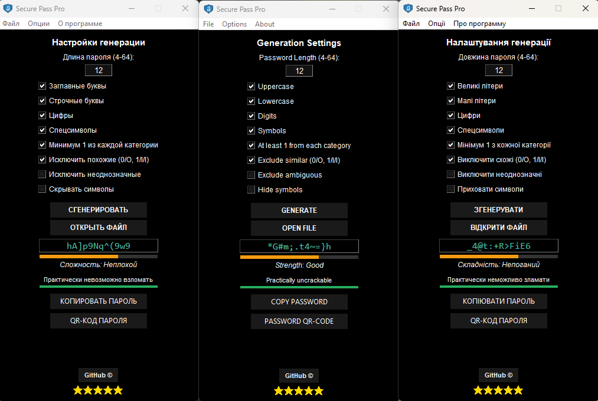

# 🔐 Secure Pass Pro v1.8.3

**Secure Pass Pro** — это мощный и интуитивно понятный генератор паролей на Python, созданный с фокусом на безопасность и удобство пользователя.

---

## 📸 Интерфейс / Interface
<p align="center">
  
</p>

---

## 🚀 Что нового в версии v1.8.3

### 🌍 Локализация и доступность
* **Мультиязычность**: Мгновенное переключение между **Русским**, **Английским** и **Украинским** языками.
* **Полный перевод**: Все элементы меню (включая динамическое «About»), системные сообщения и окна полностью локализованы.

### 📊 Индикатор сложности
* **Графический Progress Bar**: Мгновенная визуальная оценка надежности пароля.
* **Цветовая индикация**:
  * 🔴 **Красный**: Уязвимый пароль (длина до 10 символов).
  * 🟠 **Оранжевый**: Средний уровень (длина 10-13 символов).
  * 🟢 **Зеленый**: Надежный пароль (14 символов и выше).

### 🛡️ Безопасность и функционал
* **Скрытие символов**: Защита от подсматривания пароля в поле вывода.
* **Автоочистка буфера**: Автоматическое удаление пароля из памяти через 60 секунд.
* **Исключение похожих знаков**: Опция убирает символы, которые легко перепутать (`i, l, 1, L, o, 0`).
* **Экспорт**: Сохранение результатов в текстовый файл через меню «Файл».

---

## 🛠 Установка и запуск / Installation

### 📥 Для пользователей (Windows)
1. Перейдите в раздел **[Релизы](https://github.com/Maximka1993271/Password-Generator-Python/releases)**.
2. Скачайте файл**[📥 Скачайте файл](https://github.com/Maximka1993271/Password-Generator-Python/releases/download/SecurePassProv1.8.3/Secure_Pass_Pro.exe)
3. Запустите программу (установка не требуется).

### 💻 Для разработчиков
1. Убедитесь, что у вас установлен **Python 3.8+**.
2. Склонируйте репозиторий.
3. Запустите основной файл:
   ```bash
   python Secure_Pass_Pro.pyw

   👤 Разработчик / Developer
Максим Мельников
---

### Что было сделано:
1. **Прямая ссылка:** Теперь кнопка-ссылка на загрузку находится сразу под инструкцией для Windows-пользователей.
2. **Чистота кода:** Удалены лишние разделители и технические бейджи из заголовка для лаконичности.
3. **Готовность:** Проект полностью "упакован" для пользователей и коллег-разработчиков.

Поздравляю с успешным завершением оформления! Это отличный проект для вашего портфолио.
