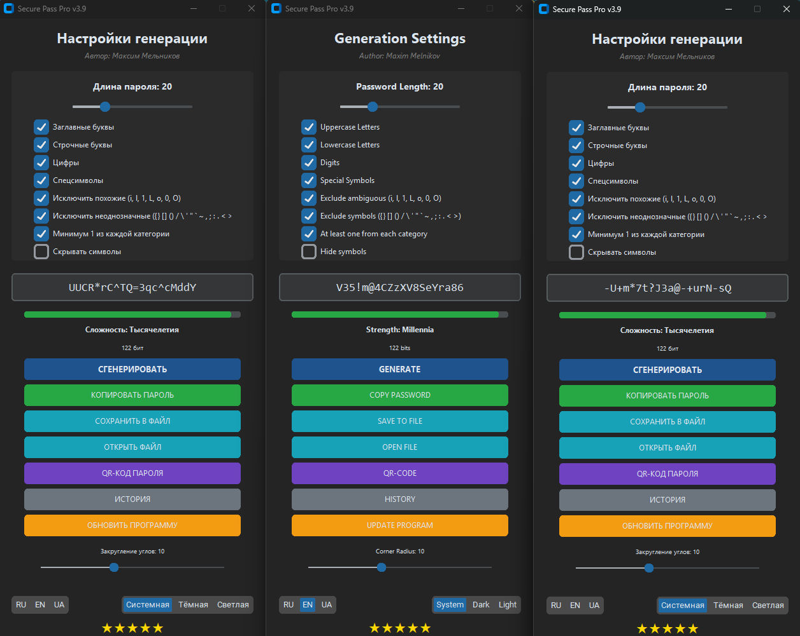
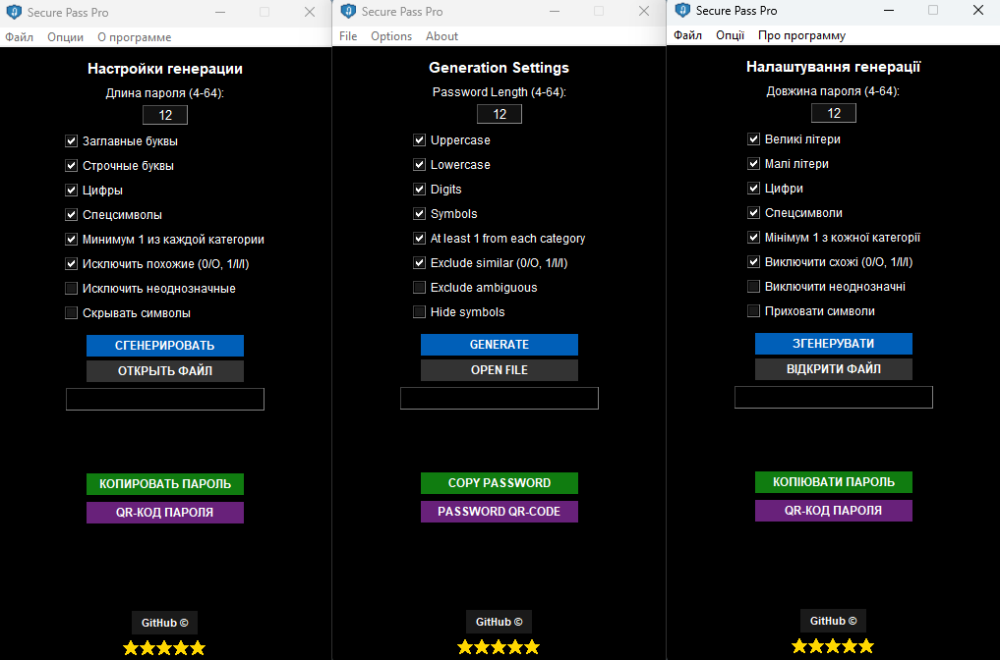

# 🔐 🛡️ Secure Pass Pro v3.9

Secure Pass Pro - это профессиональный инструмент с открытым исходным кодом для генерации криптостойких паролей. Программа сочетает в себе максимальную безопасность, современный UX в стиле Amoled и полную портативность.

## 📸 Интерфейс / Interface



## 🌟 Основные возможности

🎨 Дизайн и UX (Refined)
Amoled Dark Theme: Глубокий черный интерфейс для комфортной работы и экономии заряда на OLED-экранах.

Color-Coded Actions: Интуитивно понятная цветовая схема кнопок для быстрого ориентирования:

🔵 Синий: Генерация нового криптостойкого пароля.

🟢 Зелёный: Безопасное копирование в буфер обмена.

🐬 Бирюзовый: Работа с файлами (Сохранение и Открытие базы паролей).

🟣 Фиолетовый: Создание QR-кода для быстрой передачи на смартфон.

🔘 Серый: Просмотр истории генераций в текущей сессии.

🟠 Оранжевый: Мгновенная проверка и загрузка обновлений программы.

High DPI Awareness: Принудительная поддержка высокого разрешения (4K/2K) - все элементы остаются четкими.

Triple Localization: Полная поддержка трех языков - Русский, English, Українська.

Dynamic UI: Настройка радиуса закругления углов (от 0 до 20px) прямо в интерфейсе.

---

### 🔊 Мультимедийный отклик (NEW)

🔊 Мультимедийный отклик (Refined)
Sound Effects: Интегрированная система звуковых уведомлений (через winsound) для подтверждения действий:

Генерация: Одиночный сигнал (1000Hz).

Копирование/Сохранение: Двойной каскадный сигнал (1500Hz -> 2000Hz).

Cross-Platform Silence: Доступно для Windows (ленивый импорт winsound), на других ОС программа работает в бесшумном режиме без ошибок импорта.

---

🛡️ Безопасность (Security First)
CSPRNG (secrets): Использование модуля secrets для генерации паролей, соответствующих стандартам криптографии.

Complexity Analysis: Динамическая оценка энтропии и прогноз времени взлома (Time-to-Crack) на основе мощностей в 10 млрд проверок/сек.

Ambiguity Filter: Исключение похожих символов (i, l, 1, L, o, 0, O) для предотвращения ошибок ввода.

At-Least-One Logic: Гарантированное наличие минимум одного символа из каждой выбранной категории (заглавные, строчные, цифры, знаки).

---

### 💾 Файловая логика и стабильность (Refined)

Zero-Config Logic: Работа без файла config.ini. Все настройки применяются на лету, обеспечивая идеальную портативность.

Resource Resilience: Улучшенная функция resource_path (обработка AttributeError) гарантирует стабильное отображение иконки даже при сборке в единый .exe.

Smart Save: Кнопка «Сохранить» (Ctrl+S) автоматически вызывает диалог, если файл не выбран, или обновляет текущий.

Keyboard Shortcuts: Полноценная поддержка горячих клавиш (Ctrl+G, Ctrl+S, Ctrl+O) с корректной обработкой фокуса в полях ввода.

---

📊 Инструменты и Аналитика
QR-Code Generator: Мгновенная передача пароля на мобильное устройство без использования облачных буферов обмена.

History Manager: Локальный просмотр сессии генерации (очищается при закрытии).

Smart Save: Быстрое сохранение в .txt с автоматическим форматированием.

---

🛠 Технический стек
Core: Python 3.10+

GUI: customtkinter (модернизированный Tkinter)

Graphics: Pillow (обработка иконок и QR)

QR: qrcode

Security: secrets, string, hashlib

---

🚀 Новое в версии v3.9
Direct Update System: Кнопка «Обновить программу» теперь ведет на прямую загрузку последней версии .exe с GitHub Releases.

Enhanced Stability: Полностью переписана логика инициализации - программа работает без внешних конфигурационных файлов (config.ini), сохраняя настройки в памяти.

Sound Feedback (Windows): Звуковое подтверждение генерации (1000Hz) и копирования (каскад 1500Hz -> 2000Hz).

Silent Mode (Linux/macOS): Автоматическое отключение звуков на системах без winsound без ошибок импорта.

# 📥 Установка и запуск

## 📥 Для пользователей (Windows Portable)

1. Перейдите в раздел **[Релизы](https://github.com/Maximka1993271/Password-Generator-Python/releases)**.
2. Скачайте актуальный файл **[📥 Secure_Pass_Pro.exe](https://github.com/Maximka1993271/Password-Generator-Python/releases/download/SecurePassProv3.9/SecurePassPro.exe)**.
3. Программа является Portable - просто запустите её, установка не требуется.

---

📦 Сборка в EXE
Для создания портативного исполняемого файла используйте PyInstaller со следующими параметрами:

## 💻 Для разработчиков

### Требования:

* Python 3.14.4

### Установка зависимостей:

```bash
pip install pillow qrcode
```

### Запуск:

```bash
python Secure_Pass_Pro.pyw
```

### Сборка в .exe (Windows):

```bash
pyinstaller --noconsole --onefile --clean --icon="app_icon.ico" --add-data "app_icon.ico;." --collect-all qrcode --collect-all customtkinter --hidden-import="PIL._tkinter_finder" --hidden-import="winsound" --name "SecurePassPro" Secure_Pass_Pro.pyw
```

---

# 👨‍💻 Автор

* **Разработчик:** Максим Мельников
* **Лицензия:** MIT License
* **Версия Python:** 3.14.4
* Distributed under the MIT License. Сделано с упором на приватность и удобство.


# 🔐 🛡️ Secure Pass Pro v2.0.0 Stable

Secure Pass Pro - это профессиональный инструмент для генерации паролей с открытым исходным кодом, написанный на Python. Программа ориентирована на максимальную криптостойкость, удобство интерфейса (UX) и портативность.

## 📸 Интерфейс / Interface



## 🌟 Основные возможности

### 🎨 Дизайн и UX (Refined)

Amoled Dark Theme: Глубокий черный интерфейс в стиле AdGuard для комфортной работы и экономии энергии на OLED-экранах.

Color-Coded Actions: Интуитивно понятная цветовая схема кнопок:

🔵 Синий: Генерация нового пароля.

🟢 Зелёный: Безопасное копирование в буфер.

🟣 Фиолетовый: Создание QR-кода.

Smart Centering: Все диалоговые окна, уведомления и QR-коды автоматически центрируются относительно главного окна приложения.

High DPI Awareness: Принудительная поддержка высокого разрешения (4K/2K) - шрифты и элементы интерфейса остаются четкими.

Visual Integrity: Единая иконка приложения для всех дочерних окон и системных уведомлений.

Dynamic Feedback: Анимированные кнопки и интерактивные подсказки при наведении.

Full Localization: Полная поддержка трех языков - Русский, English, Українська.

---

### 🔊 Мультимедийный отклик (NEW)

🔊 Мультимедийный отклик (Refined)
Sound Effects: Интегрированная система звуковых уведомлений (через winsound) для подтверждения действий:

Генерация: Одиночный сигнал (1000Hz).

Копирование/Сохранение: Двойной каскадный сигнал (1500Hz -> 2000Hz).

Cross-Platform Silence: Доступно для Windows (ленивый импорт winsound), на других ОС программа работает в бесшумном режиме без ошибок импорта.

---

### 🛡️ Безопасность (Security First)

Crypto-Grade: Использование модуля secrets для генерации паролей, которые практически невозможно предугадать.

Secure Wipe: Автоматическая очистка буфера обмена ровно через 60 секунд.

Zero-Footprint: Программа не хранит историю в открытом виде и полностью очищает оперативную память при закрытии.

Advanced Exclusion: Возможность исключения похожих (0/O, 1/l/I) и неоднозначных символов.

---

### 💾 Файловая логика и стабильность (Refined)

Zero-Config Logic: Работа без файла config.ini. Все настройки применяются на лету, обеспечивая идеальную портативность.

Resource Resilience: Улучшенная функция resource_path (обработка AttributeError) гарантирует стабильное отображение иконки даже при сборке в единый .exe.

Smart Save: Кнопка «Сохранить» (Ctrl+S) автоматически вызывает диалог, если файл не выбран, или обновляет текущий.

Keyboard Shortcuts: Полноценная поддержка горячих клавиш (Ctrl+G, Ctrl+S, Ctrl+O) с корректной обработкой фокуса в полях ввода.

---

### 📊 Аналитика и Инструменты

Time-to-Crack: Прогноз времени взлома пароля на основе мощности современных систем (100 млрд проверок в секунду для MD5).

QR-Code Generator: Мгновенная генерация QR-кода с адаптивной темой для безопасного переноса пароля на смартфон.

History Manager: Быстрый доступ к последним сгенерированным паролям (динамическое обновление счетчика на кнопке).

---

### 🛠 Технические подробности

Кроссплатформенность: Полная совместимость с Windows, Linux и macOS.

Умная адаптация: Автоматическое определение и применение системной темы оформления при запуске.

Clean Code: Исходный код снабжен подробными комментариями на трех языках (RU/EN/UA) и соответствует принципам DRY.

Robust Imports: Защита от ошибок при отсутствии библиотек qrcode или Pillow.

---

# 📥 Установка и запуск

## 📥 Для пользователей (Windows Portable)

1. Перейдите в раздел **[Релизы](https://github.com/Maximka1993271/Password-Generator-Python/releases)**.
2. Скачайте актуальный файл **[📥 Secure_Pass_Pro.exe](https://github.com/Maximka1993271/Password-Generator-Python/releases/download/SecurePassProv2.0.0/Secure_Pass_Pro.exe)**.
3. Программа является Portable - просто запустите её, установка не требуется.

---

## 💻 Для разработчиков

### Требования:

* Python 3.14.4

### Установка зависимостей:

```bash
pip install pillow qrcode
```

### Запуск:

```bash
python Secure_Pass_Pro.pyw
```

### Сборка в .exe (Windows):

```bash
pyinstaller --noconsole --onefile --clean --icon="app_icon.ico" --add-data "app_icon.ico;." --collect-all qrcode --hidden-import="PIL._tkinter_finder" --hidden-import="winsound" Secure_Pass_Pro.pyw
```

---

# 👨‍💻 Автор

* **Разработчик:** Максим Мельников
* **Лицензия:** MIT License
* **Версия Python:** 3.14.4
