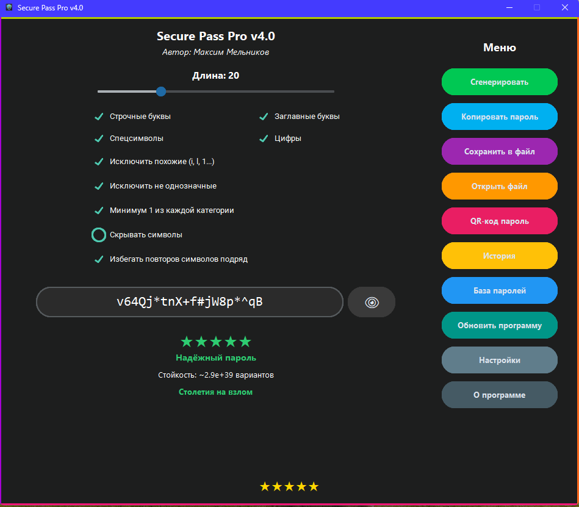

# 🛡️ Secure Pass Pro v4.0

**Профессиональный генератор и менеджер паролей с открытым исходным кодом**

**Бесплатно • Безопасно • С открытым исходным кодом**

---

## 📸 Скриншот

    
     
    <em>Secure Pass Pro v4.0 — главное окно программы</em>

---

## 📋 О программе

**Secure Pass Pro v4.0** — это профессиональный генератор и менеджер паролей с открытым исходным кодом. Программа построена на Python и CustomTkinter, сочетает криптостойкую генерацию, многоязычный интерфейс, полное шифрование данных и современный дизайн с RGB-анимацию.

| Параметр | Значение |
|----------|----------|
| **Автор** | Максим Мельников |
| **Лицензия** | MIT (бесплатно) |
| **Версия** | 4.0.0 |
| **Платформы** | Windows, macOS, Linux |
| **Языки** | Русский, English, Українська |

---

## 🚀 Основные возможности

| № | Функция | Описание |
|---|---------|----------|
| 1 | 👤 **Генератор имён** | 8 режимов: SAMP RP, Email, Игровой ник, Крутой ник, Красивый ник, Короткий, Длинный, Случайный |
| 2 | 🔐 **Генерация паролей** | Криптостойкая генерация с 8 параметрами (CSPRNG) |
| 3 | 🗄️ **База паролей** | SQLite с полным шифрованием (AES-256-GCM + SQLCipher) |
| 4 | 🔒 **Мастер-пароль** | Argon2id хеширование + PBKDF2 fallback |
| 5 | 🛡️ **Rate Limiting** | Защита от брутфорса (3 ошибки → 5 сек, 5 ошибок → 30 сек) + персистентность |
| 6 | 🌈 **RGB анимация** | Динамическая подсветка всего окна (4 границы + заголовок) с настройкой скорости и толщины |
| 7 | 🎬 **Анимация кнопок** | Визуальный отклик + механический звук |
| 8 | 🔑 **Secure Clipboard** | Защита буфера обмена (5-кратная перезапись) + отслеживание владельца |
| 9 | 🧹 **Очистка памяти** | Обнуление паролей через ctypes.memset + MemoryGuard контекст |
| 10 | 📝 **Система логирования** | Ротация логов, фильтрация sensitive данных (пароли, ключи, токены) |
| 11 | ✅ **Контроль целостности** | HMAC-SHA256 проверка файлов, fail-closed поведение |
| 12 | 📄 **PDF экспорт** | Полная поддержка кириллицы + тёмная/светлая тема |
| 13 | 📱 **QR-код** | Быстрая передача пароля на мобильные устройства |
| 14 | 🔄 **Автообновление** | Проверка подписи SHA-256, верификация целостности |
| 15 | 💾 **Автосохранение** | Автоматическое сохранение паролей в базу |
| 16 | 📜 **История** | Сохранение последних 50 паролей |
| 17 | 🖱️ **Контекстное меню** | Правая кнопка мыши |
| 18 | ⌨️ **Горячие клавиши** | F5, Ctrl+C, Ctrl+S, Ctrl+O, Esc |
| 19 | 🌐 **Полная локализация** | Полная поддержка RU, EN, UA с динамическим переключением |
| 20 | 🔄 **Fallback язык** | Автоматическое восстановление отсутствующих ключей |

---

## 🆕 НОВЫЕ ФУНКЦИИ В v4.0

### 🔐 **Двухфакторная аутентификация (2FA)**

**Полная поддержка TOTP (Time-based One-Time Password) — совместимость с Google Authenticator, Authy, Microsoft Authenticator и другими приложениями.**

| Функция | Описание |
|---------|----------|
| **TOTP генерация** | 6-значные коды, интервал 30 секунд, алгоритм SHA1/SHA256/SHA512 |
| **QR-код** | Автоматическая генерация QR для быстрой настройки |
| **Резервные коды** | 10 резервных кодов для восстановления доступа |
| **Anti-replay защита** | Защита от повторного использования кодов |
| **Brute-force защита** | Rate limiting: 5 попыток за 60 секунд |
| **Регенерация кодов** | Возможность сгенерировать новые резервные коды |
| **Отключение 2FA** | С подтверждением текущего кода |
| **Полная локализация** | Интерфейс 2FA переведён на 3 языка |

**Как настроить 2FA:**
1. Установите мастер-пароль
2. Откройте Настройки → Безопасность → 2FA
3. Нажмите "Включить 2FA"
4. Отсканируйте QR-код приложением-аутентификатором
5. Введите полученный код для подтверждения
6. Сохраните резервные коды в надёжном месте

### 🌐 **Полная поддержка 3 языков**

| Язык | Код | Статус |
|------|-----|--------|
| Русский | RU | ✅ Полностью переведён |
| English | EN | ✅ Fully translated |
| Українська | UA | ✅ Повністю перекладено |

**Особенности локализации:**
- ✅ Динамическое переключение языка без перезапуска
- ✅ Fallback механизм (при отсутствии ключа)
- ✅ Автоматическое восстановление отсутствующих ключей
- ✅ 300+ переведённых строк в каждом языке
- ✅ Локализация всех диалоговых окон
- ✅ Локализация HTML экспорта
- ✅ Локализация PDF отчётов
- ✅ **Локализация 2FA интерфейса**

### 📤 **Экспорт данных**
| Формат | Описание | Шифрование |
|--------|----------|------------|
| **JSON** | Полный экспорт со структурой | ✅ AES-256-GCM |
| **CSV** | Открывается в Excel, Google Sheets | ✅ (UTF-8, UTF-16, Windows-1251) |
| **HTML** | Красивый веб-отчёт с поиском, сортировкой и печатью | ✅ (встроенная защита) |

**Возможности экспорта:**
- ✅ Выбор полей для экспорта (ID, Метка, Пароль, Дата)
- ✅ Выбор кодировки (UTF-8, UTF-16, Windows-1251)
- ✅ Шифрование экспорта паролем (только JSON)
- ✅ **Перевод фразы "Без метки" на язык экспорта**
- ✅ Полная локализация HTML интерфейса
- ✅ **Favicon иконка в HTML экспорте**

### 📥 **Импорт данных (6 форматов)**
| Формат | Расширение | Источник |
|--------|------------|----------|
| JSON | `.json` | Secure Pass Pro |
| CSV | `.csv` | Excel, Google Sheets |
| KeePass XML | `.xml` | KeePass 2.x |
| Bitwarden JSON | `.json` | Bitwarden |
| 1Password CSV | `.csv` | 1Password |
| **1PUX** | `.1pux` | 1Password Unified Export |

**Возможности импорта:**
- ✅ Автоопределение колонок в CSV
- ✅ Поддержка разных разделителей (`,`, `;`, `\t`)
- ✅ Предпросмотр перед импортом
- ✅ Автообновление базы после импорта
- ✅ **Поддержка импорта на любом языке**
- ✅ **Фильтрация дубликатов паролей**

### 🔍 **Поиск в базе паролей**
- ✅ Поиск по **метке**, **паролю** и **дате**
- ✅ Подсветка найденных совпадений жёлтым цветом
- ✅ Мгновенная фильтрация результатов
- ✅ Счётчик видимых записей

### 🎨 **Современный дизайн настроек (как в Microsoft Edge)**
- ✅ Боковая панель с категориями (Дизайн, Безопасность, Общие)
- ✅ Карточки настроек с иконками и описаниями
- ✅ Плавное переключение между категориями
- ✅ Мгновенное применение настроек (без перезапуска)
- ✅ **Полная локализация всех настроек**
- ✅ **Строка поиска по настройкам**
- ✅ **Профили настроек (сохранение/загрузка/сброс)**

### 🔘 **Настройки интерфейса**
| Настройка | Описание |
|-----------|----------|
| **Закругление углов** | 0-25 px (мгновенное применение) |
| **Размер шрифта** | 10-20 px (плавное изменение) |
| **Тема PDF** | Светлая / Тёмная |
| **Скорость RGB** | Медленная / Нормальная / Быстрая |
| **Толщина RGB** | Тонкая / Средняя / Толстая |
| **Язык интерфейса** | Русский / English / Українська |

### 🖨️ **HTML экспорт с функциями**
| Функция | Описание |
|---------|----------|
| 🖨️ **Печать** | Кнопка печати отчёта |
| 📋 **Копирование пароля** | Клик по паролю → копирование в буфер |
| 🔍 **Поиск** | Фильтрация строк таблицы |
| 📊 **Сортировка** | Клик по заголовку столбца |
| 🎨 **Подсветка** | Найденные совпадения подсвечиваются |
| 🌐 **Локализация** | Весь интерфейс на выбранном языке |
| 📝 **Без метки** | Переводится на язык отчёта |
| 🖼️ **Favicon** | Иконка на вкладке браузера |

---

## 🔒 Улучшения безопасности в v4.0

| Улучшение | Описание |
|-----------|----------|
| **Двухфакторная аутентификация (2FA)** | TOTP с поддержкой Google Authenticator, резервные коды, anti-replay защита |
| **Anti-replay защита** | Кэш использованных кодов (100 записей, 5 минут) |
| **Brute-force защита 2FA** | 5 попыток за 60 секунд |
| **Узкие исключения** | Убраны все `except Exception`, заменены на конкретные типы |
| **Panic Cleanup** | Аварийная очистка при краше, 11+ типов исключений |
| **VM detection** | Обнаружение VirtualBox, VMware, Hyper-V через BIOS, MAC, CPU |
| **Debugger heuristics** | IsDebuggerPresent, NtQueryInformationProcess, hardware breakpoints |
| **Timing-based checks** | RDTSC, вариативность времени выполнения |
| **Sandbox detection** | Проверка диска, памяти, CPU, процессов, окружения |
| **Integrity self-checks** | SHA-256 проверка, фоновые самопроверки |
| **Анти-отладка** | Проверка аппаратных точек останова (DR0-DR7) |
| **Фоновые проверки** | Периодическая самопроверка целостности |
| **Аудит мастер-пароля** | Логирование всех попыток входа |
| **Persistent lockout** | Сохранение состояния блокировки между запусками |
| **Атомарная запись** | Защита от повреждения файлов |
| **Автобэкапы конфига** | Автоматическое создание резервных копий |
| **Восстановление БД** | Автовосстановление из бэкапа при коррупции |
| **Secure Clipboard** | 5-кратная перезапись, отслеживание владельца |
| **Secure Memory** | ctypes.memset, MemoryGuard, Memory pressure handler |
| **Фильтрация логов** | 30+ паттернов (пароли, ключи, токены, TOTP) |
| **Экспорт с шифрованием** | AES-256-GCM |

---

## 👤 Генератор имён

| Режим | Описание | Пример |
|-------|----------|--------|
| **SAMP RP** | Имена для ролевых игр | `Александр_Иванов` |
| **Email адрес** | Генерация email с транслитерацией | `ivanov.petr123@gmail.com` |
| **Игровой ник** | Крутые ники с префиксами | `xX_Killer_Xx` |
| **Крутой ник** | Стильные имена | `UltraHunter` |
| **Красивый ник** | Эстетичные имена | `Luna` |
| **Короткий (3-5)** | Краткие имена | `Max`, `Alex` |
| **Длинный (8+)** | Полные имена | `Alexander` |
| **Случайный** | Любой тип из списка | случайный выбор |

**Настройки генератора:**
- 👤 Пол: Мужской / Женский / Случайный
- 🌐 Язык: Русский / English
- ✂️ Разделитель: ДА (_) / НЕТ
- 🔢 Количество: от 1 до 10 имён за раз
- 📝 Все интерфейсы генератора имён переведены на 3 языка
- ✅ **Защита от дубликатов имён**
- ✅ **Асинхронная генерация**
- ✅ **Кнопка Отмена во время генерации**

---

## 🔒 Безопасность

| Защита | Технология | Уровень |
|--------|------------|---------|
| **Двухфакторная аутентификация (2FA)** | TOTP (RFC 6238), Google Authenticator совместимость, резервные коды, anti-replay | 🔒 High |
| Мастер-пароль | Argon2id + PBKDF2 fallback | 🔒 High |
| Шифрование БД | AES-256-GCM + SQLCipher | 🔒 High |
| Аппаратное шифрование | Windows DPAPI | 🔒 High |
| Очистка памяти | ctypes.memset + MemoryGuard | 🔒 High |
| Secure Clipboard | Windows API (5x overwrite) + отслеживание | 🔒 High |
| Rate Limiting | 5 попыток → блокировка (персистентная) | 🔒 High |
| Аудит | Логирование всех попыток входа | 🔒 High |
| Подпись обновлений | SHA-256 верификация, certificate pinning | 🔒 High |
| Целостность файлов | HMAC-SHA256, fail-closed | 🔒 High |
| Анти-отладка | IsDebuggerPresent + DR регистры + VM detection | 🔒 Medium |
| Фильтрация логов | 30+ паттернов (пароли, ключи, токены, TOTP) | 🔒 High |
| Экспорт с шифрованием | AES-256-GCM | 🔒 High |
| Panic Cleanup | Аварийная очистка при краше | 🔒 High |
| Anti-replay (2FA) | Кэш использованных кодов | 🔒 High |
| Trusted Devices | Отслеживание доверенных устройств | 🔒 Medium |

---

## 🎨 Цветовая схема кнопок

| Кнопка | Цвет | HEX |
|--------|------|-----|
| Сгенерировать | 🟢 Изумрудный | `#00C853` |
| **Генератор имён** | 🔴 Малиновый | `#E91E63` |
| Копировать пароль | 🔵 Голубой | `#00B0F0` |
| Сохранить в файл | 🟣 Фиолетовый | `#9C27B0` |
| Открыть файл | 🟠 Оранжевый | `#FF9800` |
| QR-код | 🔴 Малиновый | `#E91E63` |
| История | 🟡 Золотой | `#FFC107` |
| База паролей | 🔷 Синий | `#2196F3` |
| Проверить утечки | 🔴 Красно-оранжевый | `#FF5722` |
| Обновить программу | 🟢 Бирюзовый | `#009688` |
| **Экспорт** | 🟣 Фиолетовый | `#9C27B0` |
| **Импорт** | 🟠 Оранжевый | `#FF9800` |
| Настройки | ⚙️ Серый | `#607D8B` |
| О программе | 🔘 Тёмно-серый | `#455A64` |

---

## 🟢🔴 Цветовая индикация

| Элемент | Включено | Выключено |
|---------|----------|-----------|
| RGB подсветка | 🟢 Зелёный | 🔴 Красный |
| Звук | 🟢 Зелёный | 🔴 Красный |
| Автоблокировка | 🟢 Зелёный | 🔴 Красный |
| Автосохранение | 🟢 Зелёный | 🔴 Красный |
| Мастер-пароль | 🟢 Установить | 🔴 Удалить |
| **2FA** | 🟢 Зелёный | ⚪ Серый |

---

## ⌨️ Горячие клавиши

| Клавиша | Действие |
|---------|----------|
| `F5` | Сгенерировать пароль |
| `Ctrl+C` | Копировать пароль |
| `Ctrl+S` | Сохранить в файл |
| `Ctrl+O` | Открыть файл |
| `Esc` | Закрыть окно настроек |
| `Ctrl+Alt+Shift+P` | 🚨 Паника — экстренная очистка (если включена) |

---

## 📦 Установка и запуск

### Windows

Скачайте `SecurePassPro.exe` из раздела [Releases](https://github.com/Maximka1993271/Password-Generator-Python/releases/download/v4.0/SecurePassPro.exe)

1. Запустите файл — установка не требуется
2. При первом запуске мастер-пароль не требуется (можно установить позже)
3. Все данные сохраняются в папке `data/` рядом с EXE

---

## 🛠️ Исправления в версии 4.0

### Критические исправления безопасности
| Файл | Исправление |
|------|-------------|
| `security/antidebug.py` | 5 `except Exception` → узкие исключения, VM detection, debugger heuristics, integrity self-checks |
| `security/panic.py` | 11 `except Exception` → fail-closed logic, guaranteed cleanup, panic logging isolation |
| `security/clipboard.py` | 3 `except Exception` → clipboard ownership tracking, multi-clear strategy |
| `security/encryption.py` | Узкие исключения, key rotation, crypto self-tests, tamper-evident metadata |
| `security/master.py` | Auth audit logging, password history, session tracking, trusted devices, recovery workflow |
| `security/totp.py` | Encrypted TOTP secrets, anti-replay protection, trusted devices, rate limiting |
| `utils/secure_memory.py` | 5 `except Exception` → BufferError, OSError, RuntimeError; memory pressure handling |
| `utils/updater.py` | SHA256 verification, signed updates, rollback protection, certificate pinning |
| `utils/logger.py` | Полная фильтрация sensitive данных, JSON logs, structured logging |
| `storage/database.py` | 7 `except Exception` → sqlite3.Error, OSError; corruption recovery, backup rotation |
| `storage/config.py` | Schema validation, config versioning, migration handling, backup configs |

### GUI исправления
| Файл | Исправление |
|------|-------------|
| `gui/mixins/dialogs_mixin.py` | 9 `except Exception` → tk.TclError, RuntimeError, ValueError |
| `gui/mixins/updater_mixin.py` | 2 `except Exception` → RuntimeError, requests.RequestException; threaded updater, cancel support |
| `gui/mixins/name_generator_mixin.py` | Кнопка "Отмена" исправлена, duplicate filtering, async generation |
| `gui/mixins/master_mixin.py` | Проверки hasattr, update_idletasks(), обновление окна настроек |
| `gui/mixins/settings_mixin.py` | Мгновенное обновление окна настроек при смене языка |
| `gui/mixins/ui_setup_mixin.py` | Выравнивание чекбоксов |

### Исправления экспорта/импорта
| Файл | Исправление |
|------|-------------|
| `utils/export.py` | Encrypted exports, sanitization, secure temp files, favicon, локализация "Без метки" |
| `utils/import.py` | 2 `except Exception` → ValueError, OSError; extension validation, malformed detection |
| `utils/import_passwords.py` | CSV sanitization, duplicate detection, encoding fallback |

---

## 📄 Лицензия

MIT License — можно свободно использовать, модифицировать и распространять.

---

## 👨‍💻 Автор

**Максим Мельников**

- GitHub: [Maximka1993271](https://github.com/Maximka1993271)

---

**⭐ Если вам нравится проект, поставьте звезду на GitHub!**

Made with ❤️ by Maxim Melnikov

