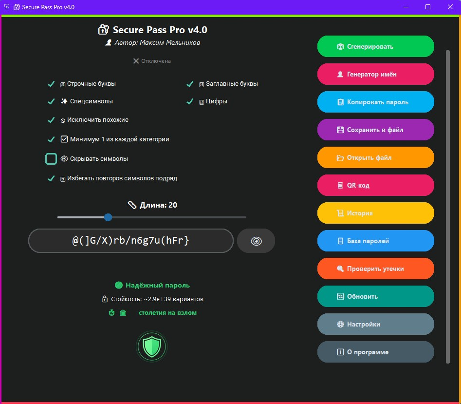
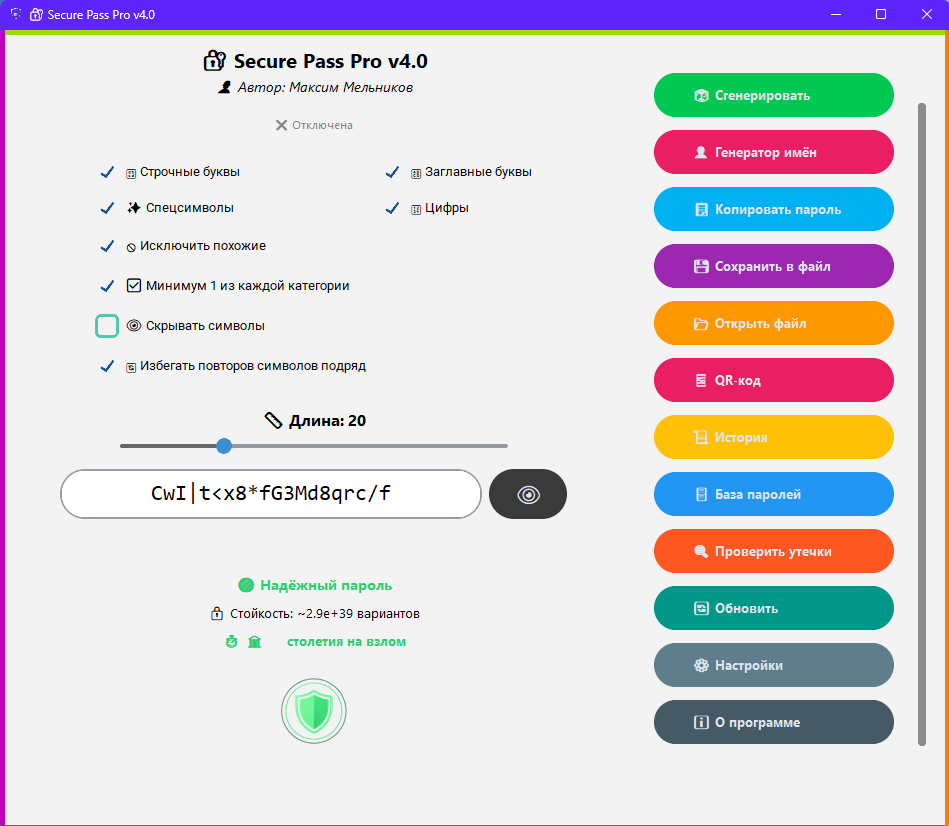

<div align="center">

<h1 align="center">Secure Pass Pro v4.0</h1>


**Профессиональный генератор и менеджер паролей с открытым исходным кодом**

[](https://python.org)
[](LICENSE)
[]()
[](https://github.com/Maximka1993271/Password-Generator-Python/releases)
[]()
[](https://github.com/Maximka1993271/Password-Generator-Python/commits)
[](https://github.com/Maximka1993271/Password-Generator-Python/releases)

<br>

**Бесплатно · Безопасно · Открытый исходный код**

[Скачать EXE](#-установка) · [Функции](#-функции) · [Безопасность](#-архитектура-безопасности) · [Скриншоты](#-скриншоты)

</div>

---

## 📸 Скриншоты

<div align="center">
  
  <br>
  <sub>Главное окно — генерация пароля с визуальной индикацией силы</sub>
</div>

<br>

<div align="center">
  
  <br>
  <sub>Иконка щита меняет цвет в реальном времени: 🔴 слабый → 🟠 средний → 🟡 хороший → 🟢 надёжный</sub>
</div>

---

## 🎯 О программе

**Secure Pass Pro** - десктопный менеджер паролей, разработанный с фокусом на безопасность и удобство. Вся криптография выполняется локально - никаких облачных серверов, никакой телеметрии, никаких сторонних хранилищ.

```
Пароли хранятся локально · Шифрование AES-256-GCM · Мастер-пароль никогда не покидает устройство
```

---

## ✨ Функции

<table>
<tr>
<td width="50%" valign="top">

### 🔐 Генерация
- **Генератор паролей** - 8 параметров настройки, CSPRNG
- **Фразы-пароли** - Diceware, каждое слово добавляет ~13 бит энтропии
- **Генератор имён** - 8 режимов: SAMP RP, Email, игровые ники и др.
- **Визуальная индикация** - щит меняет цвет по уровню надёжности

</td>
<td width="50%" valign="top">

### 🗄️ Хранилище
- **База паролей** - полное шифрование AES-256-GCM через SQLCipher
- **Мастер-пароль** - Argon2id + PBKDF2 derivation
- **2FA защита** - TOTP (Google Authenticator) + резервные коды
- **История** - 50 последних сгенерированных паролей

</td>
</tr>
<tr>
<td width="50%" valign="top">

### 📤 Импорт / Экспорт
- **Импорт из** KeePass XML, KeePass `.kdbx`, Bitwarden JSON, 1Password CSV / 1PUX, CSV, JSON
- **Экспорт в** KeePass `.kdbx`, PDF (тёмная/светлая тема, кириллица), TXT, QR-код
- **Облачная синхронизация** - WebDAV (Nextcloud, любой сервер)

</td>
<td width="50%" valign="top">

### 🛡️ Безопасность
- **Secure Clipboard** - 5-кратная перезапись при очистке
- **Очистка памяти** - `ctypes.memset` для sensitive данных
- **Анти-отладка** - `IsDebuggerPresent` + VM detection
- **Проверка утечек** - Have I Been Pwned (k-Anonymity)
- **Авто-блокировка** - блокировка по таймауту / при бездействии

</td>
</tr>
<tr>
<td width="50%" valign="top">

### 🎨 Интерфейс
- **3 языка** - Русский, English, Українська
- **3 темы** - Тёмная, Светлая, Системная
- **RGB анимация** - настройка скорости и толщины
- **Настройка радиуса** - скругление углов элементов

</td>
<td width="50%" valign="top">

### ⚙️ Дополнительно
- **Auto-Type** - автоматический ввод пароля в поле
- **Портативный режим** - работа с USB-флешки без установки
- **Автообновление** - проверка подписи перед обновлением
- **Логирование** - фильтрация sensitive данных в логах

</td>
</tr>
</table>

---

## 🔒 Архитектура безопасности

| Компонент | Технология | Описание |
|-----------|-----------|----------|
| Генерация паролей | CSPRNG (`secrets`) | Криптографически стойкий генератор |
| Шифрование БД | AES-256-GCM + SQLCipher | Аутентифицированное шифрование |
| Мастер-пароль | Argon2id + PBKDF2 | Устойчивость к brute-force |
| 2FA | TOTP (RFC 6238) | Совместимость с Google Authenticator |
| Буфер обмена | 5× overwrite | Безопасная очистка памяти |
| Анти-отладка | `IsDebuggerPresent` | Защита от анализа в runtime |
| Проверка утечек | HIBP k-Anonymity | Пароль никогда не отправляется целиком |
| Целостность файлов | SHA-256 подпись | Проверка при автообновлении |

---

## ⌨️ Горячие клавиши

| Клавиша | Действие |
|:-------:|----------|
| `F5` | Сгенерировать пароль |
| `Ctrl+C` | Копировать пароль |
| `Ctrl+S` | Сохранить в файл |
| `Ctrl+O` | Открыть файл |
| `Esc` | Закрыть настройки |

---

## 📦 Установка

### 🪟 Windows - готовый EXE

Скачайте [`SecurePassPro.exe`](https://github.com/Maximka1993271/Password-Generator-Python/releases/download/v4.0/SecurePassPro.exe) из раздела Releases и запустите — установка не требуется.

### 🐍 Запуск из исходников

```bash
# 1. Клонировать репозиторий
git clone https://github.com/Maximka1993271/Password-Generator-Python.git
cd Password-Generator-Python

# 2. Установить зависимости
pip install -r requirements.txt

# 3. Запустить
python Secure_Pass_Pro.pyw
```

### 🔧 Сборка EXE самостоятельно

```bash
python build.py
# Готовый файл: dist/SecurePassPro.exe
```

---

## 📋 Зависимости

```
customtkinter   — современный GUI фреймворк
cryptography    — AES-256-GCM шифрование
argon2-cffi     — хэширование мастер-пароля
Pillow          — работа с изображениями
qrcode          — генерация QR-кодов
fpdf2           — экспорт в PDF
pykeepass       — импорт/экспорт KeePass .kdbx
requests        — HIBP API, WebDAV синхронизация
psutil          — системная информация
pywin32         — Windows API (только Windows)
```

---

## 📁 Структура проекта

```
Secure Pass Pro/
├── core/           # Генератор паролей и логика генерации
├── gui/            # Главное окно и все диалоги (CustomTkinter)
│   └── mixins/     # Компоненты: 2FA, настройки, HIBP, RGB и др.
├── security/       # Мастер-пароль, шифрование, TOTP, анти-отладка
├── storage/        # База данных SQLCipher, конфигурация
├── utils/          # Импорт/экспорт, логгер, авто-обновление
├── Langs/          # Локализации: RU, EN, UA
├── Icons/          # Иконки и щиты индикации
├── Resources/      # Шрифты (DejaVu), словарь Diceware
└── Sounds/         # Звуки интерфейса
```

---

## 🆕 Что нового в v4.0

- ✅ Визуальная индикация силы пароля (4 цвета щита)
- ✅ Генератор фраз-паролей Diceware
- ✅ Импорт KeePass `.kdbx` и 1Password `.1pux`
- ✅ Облачная синхронизация через WebDAV
- ✅ Auto-Type - автоматический ввод пароля
- ✅ Поддержка кириллицы в PDF-экспорте
- ✅ Полный интерфейс на 3 языках

---

## 📝 Лицензия

[MIT License](LICENSE) © 2025 Максим Мельников

---

<div align="center">
  <b>Secure Pass Pro v4.0</b>
  <br>
  <sub>Безопасность - наша главная функция</sub>
  <br><br>
  Если проект полезен - поставьте ⭐ на GitHub
</div>
